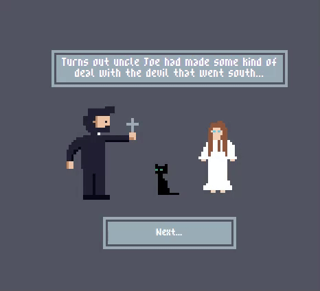

## Introduction

Exorcist Priest is a narrative-focused speed typing game which features custom 'hand-pixeled' art and animations. The website follows a priest returning home to find his family in various states of demonic possession. Assuming the role of the priest player character, the player must type Latin exorcism prayers before a timer runs out in order to get to get to the next round and continue to the end of the story. The objective of the website is to provide users with an interactive, challenging and humourous experience. Users will appreciate the art work, dialogue and humour of the story, as well as the challenge of typing one of multiple randomly selected Latin phrases under pressure.  

## UX

The primary goal was to create a short, vibrant and engaging interactive experience reminiscent of arcade cabinet video games, but recast with contemporary speed typing game mechanics. The game is inspired by Faith: The Unholy Trinity, as well as The Typing of the Dead. 

### Colour Scheme

It was important that the selected colours would complement the spooky aesthetic of the game without distracting from the pixel art animations which would form the primary visual stimuli of the website. To this end, and using the coolors.co website, I chose a pair of analogous cool greys that, in addition to black (#000000) and white (#FFFFFF), would provide an unobtrusive backdrop. 

### Typography

In keeping with the retro gaming aesthetic of the website, I chose two fonts that are stylised in pixel art styles. 

The font used for the banner logo is a free font by Leonardo Costa called [Gothic Pixel Font](https://fontstruct.com/fontstructions/show/1344429/gothic-pixel-font-1).

The font used for the rest of the text on the website is another free font by Patrik Arts called [Low Gothic](https://patrik-arts.itch.io/pixel-font-low-gothic).

A [Font Awesome](https://fontawesome.com) icon was also used for the social media icon in the webpage footers.

## User Stories

### New Site Users

- As a new site user, I would like to know the purpose of the website.
- As a new site user, I would like the website to be easily navigable.
- As a new site user, I would like the website to have good SEO scores and semantic elements so that I can easily find it through a search engine.
- As a new site user, I would like to be assured that the interactive elements of the website work are functional.

### Returning Site Users

- As a returning site user, I would like to know where I can find further information on the business, such as their social media presence. 

## Wireframes

To follow best practice, wireframes were developed for mobile, tablet, and desktop sizes.
I used [Balsamiq](https://balsamiq.com/wireframes) to design my site wireframes.

### Mobile Wireframes

 Click here to see the Mobile Wireframes

### Tablet Wireframes

 Click here to see the Tablet Wireframes

### Desktop Wireframes

 Click here to see the Desktop Wireframes

## Features

### Existing Features

#### Logo

Upon arriving on the main menu, the logo is apparent at the top of the screen. This tells the user what website they are on. 

#### Landing Page Animation Loop

The landing page of the website is primarily characterised by the stylised pixel art cross, which features a loop of a gleaming effect.

#### Navigation Bar

Upon entering the page, there is clearly a navigation bar that orients the user and gives them two options as to where they can go. 

#### Start Button

Clicking the Start Button starts the game. 

#### How to Play Button and Return Buttons

Clicking the How to Play button makes a box pop up which shows the rules of the game. A Return button allows the user to return back to the main menu. 

#### Favicon

The pages of the website have a favicon of the cross from the animation loop on the main menu/landing page. 

#### Footer and Social Media Link

The footer is present on the main page and the 404 page. It constantly remains at the bottom of the webpage at all times. It contains a social media link that opens up in a new tab. 

#### 404 Page

If there is a 404 error, the user will be sent to the 404 page. This page features an illustration of the priest player character, with a Return to Main Menu button which provides a link back to index.html.  

#### Opening Sequence

Upon clicking the Start button on the main page, an opening animation with first-person narration from the perspective of the priest player character commences. 

#### Continue Button

After the opening sequence and between typing rounds, the Continue button allows the user to interact with the website and progress to the next part of the game and story.

#### Prayer Display, Player Input and Timer

The main gameplay mechanic is facilitated through these three boxes, which appear once a typing round begins. The player is must type what is shown in the Prayer Display area in the Player Input area. If the input is correct, the corresponding character in the Prayer Display area turns green in colour. If the input is incorrect, the corresponding character turns red. The correct input must be put into the Player Input area before the timer counts down from ten to zero, or the player will lose the game.

Under the hood, the game inserts one of 20 Latin phrases into the Prayer Display Area. This ensures replayability and that the player won't play the same game twice.

#### Reactive Enemy Animation Display

Each typing round is characterised by a section which displays enemy intro, fight, and defeat animations.

Upon clicking the Next button, the animation display reacts and changes. The animation also changes from the respective enemy's fight animation to their defeat animation once the user correctly types out the Latin phrase before the timer runs out.

#### Lose State

If the player fails to enter the prayer before the timer runs out, a box appears stating "You lose! Try again". Upon clicking the red "Retry" button, the player is returned to the main menu. 

#### Closing Animation and Return to Main Menu Button

If the player completes all three rounds successfully, they will the closing sequence and see the end of the story. Once the final animation is playing, a button will appear providing access back to the main menu. 

### Future Features

- Audio
    - Originally, an interactive audio component was to be included. However, it was too much work within the timeframe of the project. Intro and outro music, fight music, and transition chimes between scenes will be needed for a truly immersive experience. 
- Health System
    - Instead of a round per enemy, it would be better if there were multiple rounds per enemy. If the player failed to enter the text in time, they would lose one heart out of a maximum of three; upon winning a round, the player would recover some health before moving onto the next round.
- Increasing difficulty
  - The length of the phrases to be typed and the amount of available time will become more challenging as the levels progress. 
- Larger RPG World
  - Using a web library such as phaser.js or three.js, a top-down RPG style environment could be created in which the player character could freely move about. Typing rounds could be triggered in the same manner as turn-based battles in RPGs. 
- Improved Art
  - ... and more of it - more animations, more detail, more characters. 

## Tools & Technologies Used

-  used to generate README and TESTING templates.
-  used for version control. (`git add`, `git commit`, `git push`)
-  used for secure online code storage.
-  used as a cloud-based IDE for development.
-  used for the main site content.
-  used for the main site design and layout.
-  used for user interaction on the site.
-  used for hosting the deployed front-end site.
-  used for creating wireframes.
-  used for the social media link icon.
-  used to help debug, troubleshoot, and explain things.
- [Aseprite](https://www.aseprite.org/) was used in the creation of the custom pixel art assets. 
- [EZGif](https://ezgif.com/video-to-gif) was used to convert MP4 screengrabs into gifs seen in README.md and TESTING.md. 

## Testing

> [!NOTE]  
> For all testing, please refer to the [TESTING.md](TESTING.md) file.

## Deployment

The site was deployed to GitHub Pages. The steps to deploy are as follows:

- In the [GitHub repository](https://github.com/cthlbrennan/exorcist-priest-game), navigate to the Settings tab 
- From the source section drop-down menu, select the **Main** Branch, then click "Save".
- The page will be automatically refreshed with a detailed ribbon display to indicate the successful deployment.

The live link can be found [here](https://cthlbrennan.github.io/exorcist-priest-game/)

### Local Deployment

This project can be cloned or forked in order to make a local copy on your own system.

#### Cloning

You can clone the repository by following these steps:

1. Go to the [GitHub repository](https://github.com/cthlbrennan/exorcist-priest-game) 
2. Locate the Code button above the list of files and click it 
3. Select if you prefer to clone using HTTPS, SSH, or GitHub CLI and click the copy button to copy the URL to your clipboard
4. Open Git Bash or Terminal
5. Change the current working directory to the one where you want the cloned directory
6. In your IDE Terminal, type the following command to clone my repository:
	- `git clone https://github.com/cthlbrennan/exorcist-priest-game.git`
7. Press Enter to create your local clone.

#### Forking

By forking the GitHub Repository, we make a copy of the original repository on our GitHub account to view and/or make changes without affecting the original owner's repository.
You can fork this repository by using the following steps:

1. Log in to GitHub and locate the [GitHub Repository](https://github.com/cthlbrennan/exorcist-priest-game)
2. At the top of the Repository (not top of page) just above the "Settings" Button on the menu, locate the "Fork" Button.
3. Once clicked, you should now have a copy of the original repository in your own GitHub account!

### Local VS Deployment

To my knowledge, there is no difference between the local version on Gitpod and the live deployed version on Github Pages.

## Credits

### Content

| Source | Location | Notes |
| --- | --- | --- |
| [Markdown Builder](https://tim.2bn.dev/markdown-builder) | README and TESTING | tool to help generate the Markdown files |
| [Code Institute](codeinstitute.net) | Entire Site | Some stucture and code taken from Love Maths Walkthrough Project and Javascript Essentials Module |
| [W3 Schools](https://www.w3schools.com/js/js_arrow_function.asp) | script.js | Use of arrow functions|
|[W3 Schools](https://www.w3schools.com/jsref/met_win_settimeout.asp) | script.js | Use of setTimeout() |
|[UI.dev](https://ui.dev/amiresponsive) | entire site | Am I Responsive tool
|[Coolors](https://coolors.co) | entire site | Palette Generator Tool
|[Drew Conley](https://www.youtube.com/watch?v=ekI7vjkFrGA) | entire site | Video, 'Spritesheet Animation with HTML and CSS'|
|[Web Dev Simplified](https://www.youtube.com/watch?v=R-7eQIHRszQ) | entire site | Video, 'Build a Speed Typing Game with Javascript'|

### Media

| Source | Location | Type | Notes |
| --- | --- | --- | --- |
| Created by Cathal Brennan on Aseprite | entire site | Pixel Art Images | All pixel assets |
| [Font Awesome](https://fontawesome.com) | entire site | image | Social media link icons in footer |
| [Leonardo Costa](https://fontstruct.com/fontstructions/show/1344429/gothic-pixel-font-1) | entire site | font | Gothic Pixel Font |
| [Patrik Arts](https://patrik-arts.itch.io/pixel-font-low-gothic) | entire site | image | Low Gothic Font |

### Acknowledgements

Thanks to Tim Nelson for his help and guidance. 
Thanks to Marko Tot for same. 