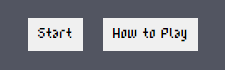
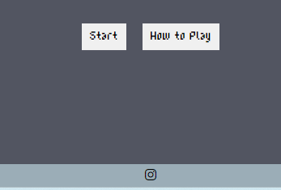

# Testing

> [!NOTE]  
> Return back to the [README.md](README.md) file.

## Compatibility 

The compatibility of both pages of the website have been tested on different browsers including Google Chrome, Microsoft Edge and Mozilla Firefox. 

 Click here to see Compatibility with Google Chrome 

 Click here to see Compatibility with Mozilla Firefox 

 Click here to see Compatibility with Microsoft Edge 

It is evident that the website is compatible with multiple browsers.

## Responsiveness

### index.html 

As can be seen below, index.html responds well when tested on different device sizes. Given the precision needed to manage the many animation spritesheets and multiple keyframes, much of it through Javascript, the animation display areas do not adjust to responsiveness as this would have required an inordinate amount of work given the scope and scale of the project. However, as the spritesheet and keyframe animation for the opening game loop was simple, I was able to add in some responsive design for this element. 

### 404.html

This is a very simple page which can be seen below to respond proportionately to different widths.  

## Manual Testing

Below, I provide the results of having manually tested each of the website's features.

|Page Feature|Action(s)|Expected result|Tested|Passed/Failed|
|-------|-------|------|------|-------------|
Logo |Checking to see if it's there |Go to index.html, it's on the opening land menu |Yes|Pass| 
Intro animation loop |Checking to see if it's there |Go to index.html, see if the loop works |Yes|Pass|      |
Logo |Checking to see if it's there |Go to index.html, it's on the opening land menu |Yes|Pass|
|Navigation Bar / Menu Options |Look at menu options |It's present on the main menu|Yes|Pass|        
|Start Button |Click it   |Starts intro animation and starts game |Yes   |Pass  |            
|How to Play Button |Click it   |Brings up How to Play pop up box |Yes   |Pass  |            
|Services menu option |Click it   |Clicking Services sends to services.html |Yes   |Pass  |           
|Start Button |Click it   |Starts intro animation and starts game |Yes   |Pass  |            
Return button under How to Play box |Click it   |Gets rid of pop up box and returns main menu layout |Yes   |Pass  |            
|Social Media Icon Link |Click it|Opens a new tab linking to social media page   |Yes   |Pass  |           
|404.html | Intentionally go to incorrectly spelt address i.e. https://cthlbrennan.github.io/exorcist-priest-game/index.htm, with the "l" missing at the end| This intentional mistake will lead user to 404.html  |Yes   |Pass         | 
|404.html | Go to address which I know doesn't exist in file directory i.e. https://cthlbrennan.github.io/exorcist-priest-game/whoops.html| This intentional mistake will lead user to 404.html  |Yes   |Pass         | 
|Return to Main Menu button on 404.html |Click it|Return to index.html main menu landing page|Yes   |Pass  | 
Intro cinematic display |Check if this plays upon clicking start button on main menu |It plays |Yes|Pass|
Enemy animation display |Play through the game and see if animations load in and out of this page throughout the three typing rounds due to Players winning/pressing the continue button when prompted |Animations load in and out as expected |Yes|Pass|
Prayer Display Area |Play game | This feature appears and disappears as expected, the characters within the area turn green or red depending on player input, with different randomly selected prayers on different playthroughs |Yes|Pass|
Player Input Area |Play game | This feature appears and disappears as expected, it allows for player input which interfaces with prayer display area as set out above |Yes|Pass|
Continue/Next button |Play game | This feature allows for transition from intro cinematic sequence, to successive typing rounds, to outro cinematic sequence |Yes|Pass|
Dialogue Boxes |Play game | Narration from player character appears and disappears as expected |Yes|Pass|
Timer |Play game | Timer counts down from 10 for each round, timer resets to 10 after each round |Yes|Pass|
Lose state |Play game | If timer during typing round gets to zero before player input area is correctly filled, the 'You lose ! Try Again' box appears with a 'Retry' button that leads back to main menu/landing page |Yes|Pass|
Retry button for lose state |Play game | Clicking the 'Retry' button will lead back to main menu/landing page |Yes|Pass|
Outro cinematic sequence |Play game | After finishing third round, the outro sequence plays as expected |Yes|Pass|
Return to Main Menu button at end of outro cinematic sequence |Play game | This button shows up at the end of the closing sequence, clicking it leads back to main menu |Yes|Pass|
|Favicon |Look at it  |It's on the browser tab for every page of the website  |Yes   |Pass         |         
|Footer |Increase and decrease screen width  |Elements in footer grow and shrink proportionately  |Yes   |Pass         |        | 

I am confident that the features of my website work correctly. 

## Code Validation

### HTML

I have used the recommended [HTML W3C Validator](https://validator.w3.org) to validate all of my HTML files.

| File | Screenshot | 
| --- | --- |
| 404.html |  |
| index.html |  |

### CSS

I have used the recommended [CSS Jigsaw Validator](https://jigsaw.w3.org/css-validator) to validate my CSS file.

As can be seen below, my CSS file was validated with no errors.

| File | Screenshot |
| --- | --- |
| style.css |  | |

### JavaScript

I have used the recommended [JShint Validator](https://jshint.com) to validate all my JS file.

| File | Screenshot|
| --- | --- |
 script.js | 

## Lighthouse Audit

I've tested my deployed project using the Lighthouse Audit tool to check for any major issues.

| Page | Mobile | Desktop | Notes |
| --- | --- | --- | --- |
| Index |  |  | Good performance on mobile and desktop |
| 404 |  |  | A minor warning for accessibility on mobile and desktop |

## User Story Testing

| User Story | Screenshot |
| --- | --- |
| As a new site user, I would like to know the purpose of the website. | |
| As a new site user, I would like the website to be easily navigable. |  |
| As a new site user, I would like the website to have good SEO scores and semantic elements so that I can easily find it through a search engine.|  |
| As a new site user, I would like to be assured that the interactive elements of the website work, so that I may have a positive experience that wouldn't result in frustration. |  |
| As a returning site user, I would like to know where I can find further information on the business, such as their social media presence. |  |

## Bugs

### 1 - Animation Loop not appearing on main menu

Upon landing on the main menu, the cross animation wasn't visible, even though the keyframe, animation style property, and file path were all apparently correct. 

However, after some time, I realised that the animation shorthand property actually was incorrect - instead of saying '0.1s' as required, I needed to say '1.0s' - this value can't just be a floating point, there needs to be a number before the floating point for the property to work properly.

This was later changed to 3s, as the animation was much too fast at 0.1s. 

### 2 - Horizontal Overflow

There was vertical overflow on the main landing page. 

After examining the main element styling rule, I realised I had set display:block instead of display:flex. 

Once this was corrected, the footer appeared at the bottom of the viewport, removing vertical overflow issues.

### 3 - Intro sequence/game not starting after clicking start button

Upon clicking the start button, a blank screen with no elements would appear.

After some time analysing the javacript code, I realised that the arrangement of my divs was wrong.

Once this was fixed, the intro sequence started and the game was operational.

### 4 - Enemy animation not working

The very first enemy animation sequence featuring the cat was not functional at first.

However, I eventually figured out that the animation property included a semi-colon before the ending quotation mark. 

Once this was removed, the animation was functional again.

### 5 - Enemy animations and prayer display area not loading properly between rounds

The animations and prayer display area did not load properly transitioning from the first typing round to the second

This was frustrating, as I had been very diligent in ensuring that Event Listeners attached to buttons were connected to the right elements in the DOM. 

With some research using ChatGPT, I eventually realised that my code was producing unexpected behaviour as I was adding multiple Event Listeners to the same element, without removing the previous Event Listener. I had assumed that an Event Listener applied to an element as part of a javascript function would go out of scope at the end of the function, but this is not the case - as the Event Listener is applied to an element in the DOM, it does not go out of scope as I had expected. I then went through my code and sought to remove Event Listeners applied to elements once that functionality had ended.

Once this fix was applied, the program ran as expected.

### 6 - Start Button/How to Play Button

Through bug-testing the game, I found that the game could continue with the How to Play box onscreen if it was not turned off before pressing the Start button. When this would happen, there would be no way to turn the box off after the game had started.

To fix this, I removed the inline javascript 'onclick=function()' functionality I had in the HTML as a means to ensure separation of concerns and follow best practice in this respect. I then added Event Listeners instead, and provided the following code to ensure that users could not click the Start button while the How to Play box was displayed.

## Unfixed Bugs

During my time working on this project, I have noticed that there were two problems raised within my IDE. 

Having done some research on Stack Overflow, Google, Phind, etc, I believe that this bug may relate to the recent Gitpod migration process that Code Institute has carried out. In any case, it does not seem to have any bearing on the operation of my website, so I have left this bug unaddressed for now. 

Every tenth time playing through the game, I will find that the game will exhibit unexpected behaviour. The behaviour is inconsistent, and is likely due to the extent to which I used Event Listeners on the same element.

Even if I subsequently removed an Event Listener from an element before adding another, the way I approached this aspect of my code, in hindsight, was probably improper. In the future, when I apply an Event Listener to an element for it to operate as a button, it would be best to give that element that sole functionality, and not try to constantly manipulate the same elements of the DOM to provide functionality. Given the scope of the project, refactoring script.js would have been too onerous. However, trying to understand this issue and rectify it over the last few days has been very educational, and I'll know not to do it again in future projects. 

> [!NOTE]  
> There are no other remaining bugs that I am aware of.